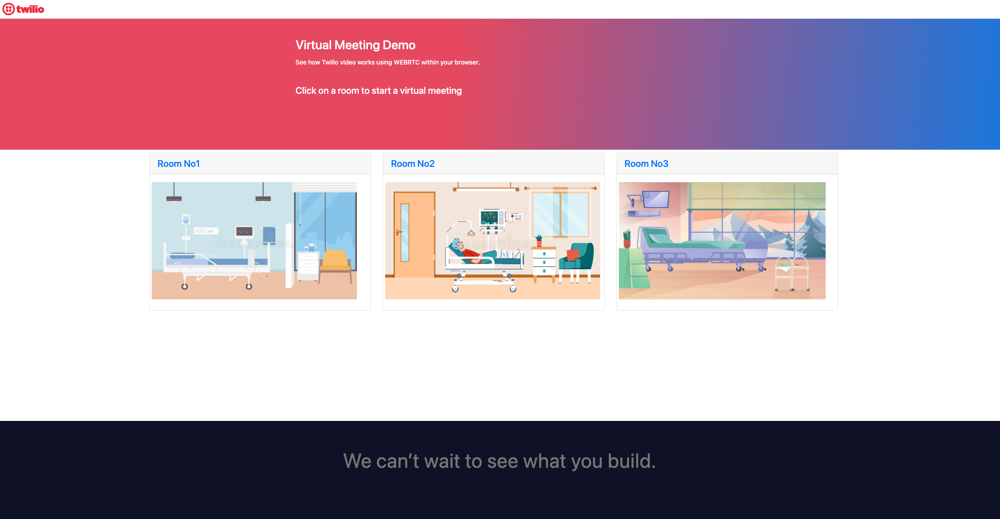
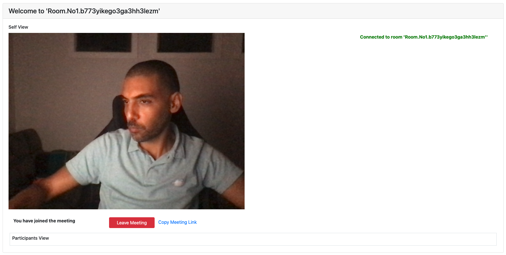
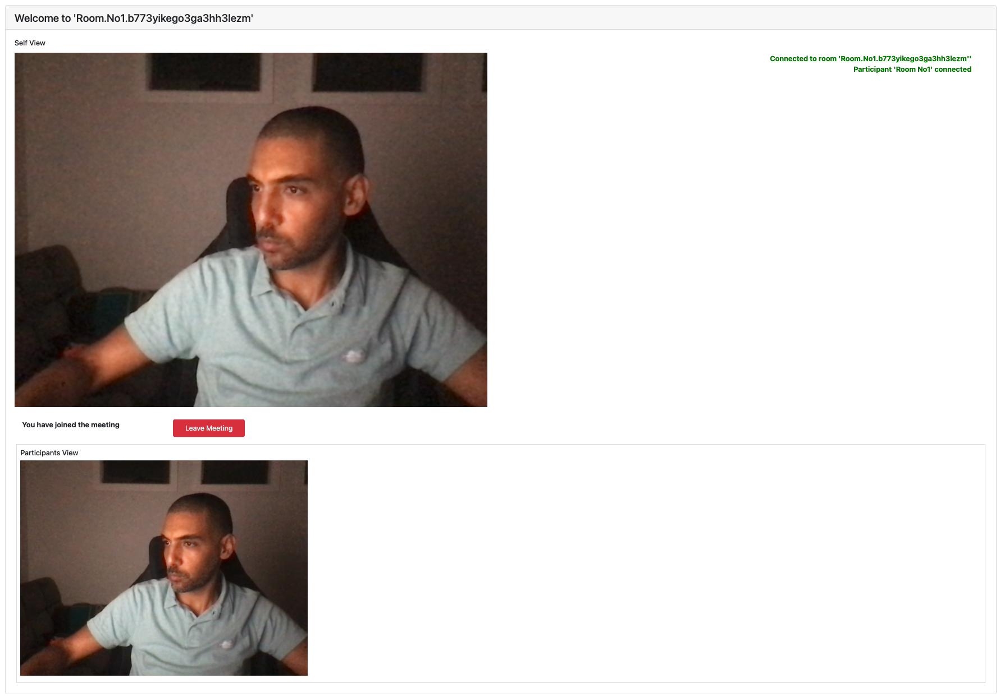
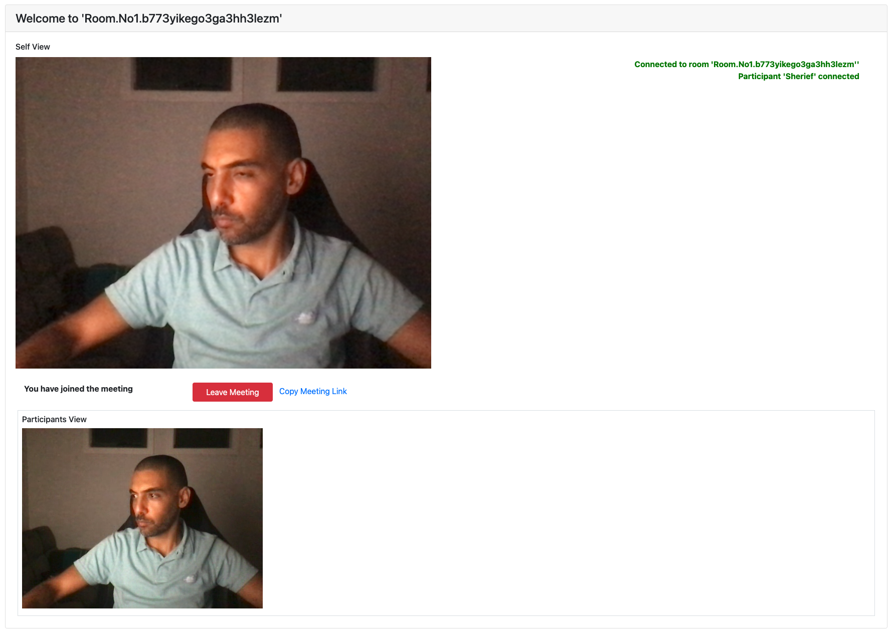

# twilio-video-one-on-one

A basic video conference app with Twilio Video. This app will generate a passcode-protected conference room and you can enter, leave, and invite others [Check out this code exchange for a walkthrough of the app](https://www.twilio.com/code-exchange/basic-video-chat?language=functions).

---
## Pre-requisites

### Environment variables

This project requires some environment variables to be set. To keep your tokens and secrets secure, make sure to not commit the `.env` file in git. When setting up the project with `twilio serverless:init ...` the Twilio CLI will create a `.gitignore` file that excludes `.env` from the version history.

In your `.env` file, set the following values:

| Variable     | Description                                                                       | Required |
| :----------- | :-------------------------------------------------------------------------------- | :------- |
| `ACCOUNT_SID`| Find in the [console](https://www.twilio.com/console)                             | Yes      |
| `API_KEY`    | Twilio API Key. Create one here (https://www.twilio.com/console/runtime/api-keys) | Yes      |
| `API_SECRET` | Twilio API Secret corresponding to your API Key                                   | Yes      |
| `PASSCODE`   | A passcode to gate your video call                                                | Yes      |

### Function Parameters

`/video-token` expects the following parameters:

| Parameter | Description                                  | Required |
| :-------- | :------------------------------------------- | :------- |
| passcode  | The passcode the user entered on the website to join the conference | Yes      |
| roomName  | The roomName the user want to start conference on the website | Yes      |

`/video-room-create` expects the following parameters:

| Parameter | Description                                  | Required |
| :-------- | :------------------------------------------- | :------- |
| uniqueName  | The uniqueName for the room to be created for the conference | Yes      |

---

## Start the application locally

1. Install the packagaes

```shell
npm ci
```

2. Install [Twilio CLI](https://www.twilio.com/docs/twilio-cli/quickstart#install-the-twilio-cli)

```
brew tap twilio/brew && brew install twilio
```

3. Install [Serverless Plugin](https://www.twilio.com/docs/twilio-cli/quickstartt#install-the-serverless-plugin)

```
twilio plugins:install @twilio-labs/plugin-serverless
```

4. Start the server locally with the Serverless Plugin:

```
twilio serverless:start
```

4. Open the web page at https://localhost:3000/index.html to test the app

ℹ️ Check the developer console and terminal for any errors, make sure you've set your environment variables.

---

## Deploy the application

Deploy your functions and assets with the following command. 

```shell
twilio serverless:deploy --environment=dev --env=.env.dev
```

ℹ️ Note: you must run the commands from inside your project folder. [More details in the docs.](https://www.twilio.com/docs/labs/serverless-toolkit)
---

## Screen Shots





